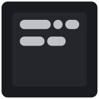

[Website]: https://flags.sh
[Website Badge]: https://img.shields.io/badge/Website-202b38?labelColor=202b38&logo=html5&logoColor=white&style=flat-square
[Support]: https://encode42.dev/support
[Support Badge]: https://img.shields.io/discord/646517284453613578?color=7289da&labelColor=7289da&label=​&logo=discord&logoColor=white&style=flat-square
[Codacy]: https://app.codacy.com/gh/Encode42/flags.sh/dashboard
[Codacy Badge]: https://img.shields.io/codacy/grade/fcab733f761c4c09a0216f89feb95797?color=172B4D&labelColor=172B4D&label=​&logo=codacy&style=flat-square

# flags.sh
### A simple script generator to start your Minecraft servers with optimal flags.

[![][Website Badge]][Website] [![][Support Badge]][Support]  
[![][Codacy Badge]][Codacy]

Includes many configuration options such as Aikar's flags, automatic restarting, and Pterodactyl overhead calculation.

Inspired by [startmc.sh](https://startmc.sh), built with [Blitz.js](https://blitzjs.com) and [Mantine UI](https://mantine.dev).

### 🔨 Building
Ensure [Yarn](https://yarnpkg.com) and [Node.js](https://nodejs.org/en) are installed.

1. Enter the directory containing the flags.sh source code in your terminal.
2. Install the build dependencies via `yarn install`.
3. Either start a live development environment, or build for production.
   - `yarn run dev`: Start a live development environment
   - `yarn run export`: Build for production to `/out/`
